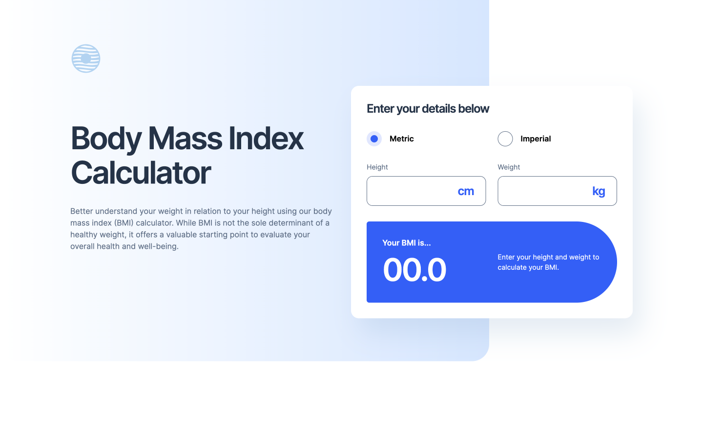

# BMI Calculator

A responsive BMI calculator built as a solution to the Frontend Mentor Body Mass Index Calculator challenge.

Users can calculate their BMI using either metric or imperial measurements and receive their BMI category and a healthy weight range based on their height.

---

## Table of Contents

- [Overview](#overview)
  - [The Challenge](#the-challenge)
  - [Screenshot](#screenshot)
  - [Links](#links)
- [My Process](#my-process)
  - [Built with](#built-with)
  - [Technical Highlights](#technical-highlights)
  - [What I Learned](#what-i-learned)
  - [Continued Development](#continued-development)
  - [Useful Resources](#useful-resources)
  - [AI Collaboration](#ai-collaboration)
- [Author](#author)

---

# Overview

## The Challenge

The goal of this project was to build a responsive BMI calculator that allows users to:

- Enter their height and weight
- Switch between metric and imperial measurements
- Calculate BMI dynamically as values are entered
- Display the user's BMI and corresponding BMI category
- Calculate a healthy weight range based on the user's height
- Validate height and weight input ranges
- Display helpful validation messages for invalid input
- View information about the limitations of BMI
- View health-related tips included in the provided design
- Experience responsive layouts across desktop, tablet, and mobile devices

## Screenshot

## Links

- Solution URL: [GitHub Repository](https://github.com/dlewisSTL/BMI-Calculator)
- Live Site URL: [Live Demo](https://bmi-calculator-one-tau-56.vercel.app)

---

# My Process

## Built with

- Semantic HTML5 markup
- CSS custom properties
- CSS Flexbox
- CSS Grid
- Responsive design
- Vanilla JavaScript
- DOM manipulation
- Form input validation
- CSS animations and transitions
- Intersection Observer API
- Accessible form controls

## Technical Highlights

- Built a responsive BMI calculator using vanilla JavaScript
- Implemented metric BMI calculations using centimeters and kilograms
- Implemented imperial BMI calculations using feet, inches, stones, and pounds
- Added dynamic switching between metric and imperial measurement systems
- Reset calculator values when switching measurement systems
- Added input validation for metric height and weight
- Added input validation for imperial height and weight
- Added BMI category calculations based on standard BMI ranges
- Calculated a healthy weight range based on the user's height
- Converted healthy weight ranges into stones and pounds for imperial measurements
- Added numeric keyboard input restrictions
- Added animated transitions when measurement fields change
- Added reduced-motion support using prefers-reduced-motion
- Added scroll-triggered animations using the Intersection Observer API
- Created responsive layouts for desktop, tablet, and mobile screens

---

## What I Learned

This project helped strengthen my understanding of building interactive frontend applications with vanilla JavaScript while working with form inputs, validation, calculations, responsive layouts, and browser APIs.

Some of the main concepts I practiced:

### BMI Calculation

I implemented BMI calculations for both metric and imperial measurement systems.

The calculator converts the user's measurements into the appropriate units before calculating BMI and displaying the result to one decimal place.

### Form Validation

I practiced validating user input before performing calculations.

Validation includes:

- Required input checking
- Numeric value validation
- Metric height limits
- Metric weight limits
- Imperial height limits
- Imperial inch limits
- Imperial weight limits
- Imperial pound limits

Invalid values display an appropriate message instead of producing a BMI result.

### Measurement System Switching

I implemented a measurement system selector that allows users to switch between metric and imperial measurements.

When the measurement system changes:

- The appropriate input fields are displayed
- Unused measurement fields are hidden
- Existing calculator values are reset
- The BMI result is reset
- The default calculator message is restored
- Entry animations are triggered for the newly displayed fields

### Healthy Weight Range

I implemented healthy weight range calculations based on the user's height.

The calculator displays the range using kilograms for metric measurements and stones and pounds for imperial measurements.

### DOM Manipulation

I practiced using JavaScript to keep the calculator interface synchronized with user input.

This includes:

- Reading input values
- Updating BMI results
- Updating BMI categories
- Updating healthy weight ranges
- Displaying validation messages
- Showing and hiding measurement fields
- Resetting the calculator interface

### Responsive CSS

I used CSS Grid, Flexbox, custom properties, media queries, and responsive sizing to create layouts that adapt across:

- Desktop
- Tablet
- Mobile

### Intersection Observer

I used the Intersection Observer API to trigger animations as content enters the viewport.

This was used for:

- Health tip sections
- BMI limitation cards

The observer stops observing each element after its animation has been triggered, preventing the animation from being triggered repeatedly.

### Accessibility and Reduced Motion

I practiced building interactive controls with accessibility in mind while also respecting users who prefer reduced motion.

The project uses:

- Semantic form controls
- Native radio buttons with custom styling
- Keyboard-accessible inputs
- Screen-reader-only content where needed
- prefers-reduced-motion to disable non-essential animations

---

## Continued development

Future improvements I would like to explore:

- Further improve form accessibility and validation messaging
- Add more comprehensive keyboard and screen reader testing
- Improve the visual feedback for invalid input
- Explore additional BMI calculation standards and contextual information
- Rebuild the calculator using React and TypeScript to compare the architecture with the vanilla JavaScript implementation
- Continue building more complex frontend projects to strengthen JavaScript and application-development skills

---

## Useful resources

- [Frontend Mentor](https://www.frontendmentor.io/) - Provided the design challenge and project requirements.

- [MDN Web Docs](https://developer.mozilla.org/) - Used as a reference for JavaScript, DOM APIs, CSS, browser APIs, and accessibility.

- [JavaScript.info](https://javascript.info/) - Helpful reference for JavaScript concepts and patterns.

---

## AI Collaboration

I used ChatGPT as an AI development assistant throughout this project.

AI was used for:

- Debugging JavaScript issues
- Reviewing HTML, CSS, and JavaScript
- Discussing accessibility improvements
- Reviewing application structure
- Exploring code organization and refactoring opportunities
- Troubleshooting calculator behavior
- Reviewing form validation logic
- Discussing responsive CSS
- Reviewing the final project before completion

The development process remained hands-on, with AI acting as a collaboration and problem-solving tool rather than replacing implementation.

---

# Author

- Website - [Derek Lewis](https://derek-lewis.com/)
- Frontend Mentor - [@dlewisSTL](https://www.frontendmentor.io/profile/dlewisSTL)

